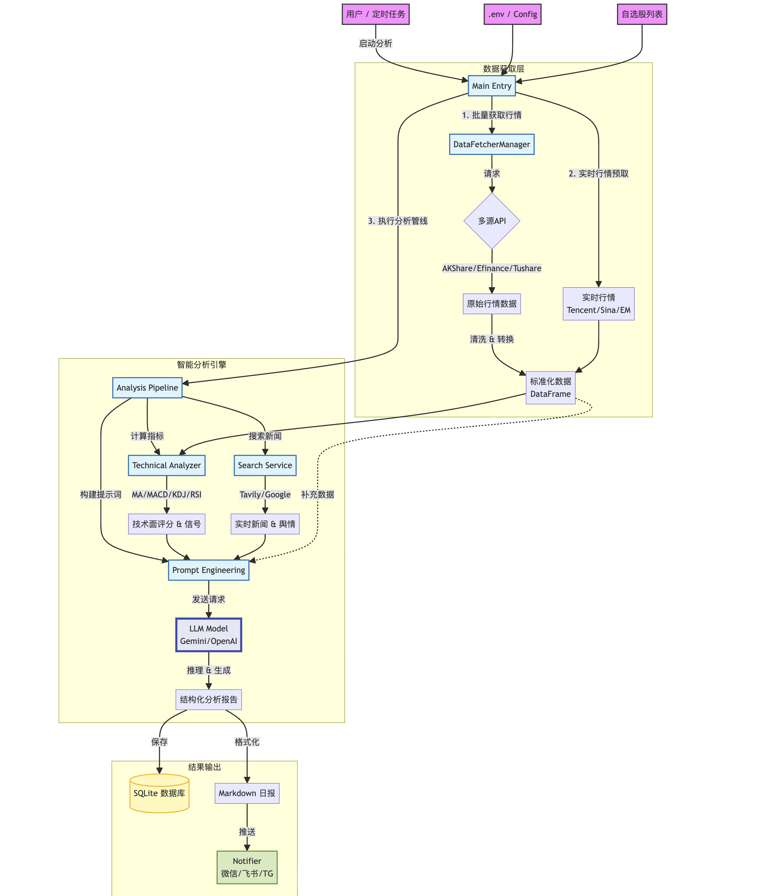

# 项目原理与架构解析

## 1. 系统工作流程图 (Mermaid)





```mermaid
graph TD
    %% 定义样式
    classDef input fill:#f9f,stroke:#333,stroke-width:2px;
    classDef process fill:#e1f5fe,stroke:#0277bd,stroke-width:2px;
    classDef storage fill:#fff9c4,stroke:#fbc02d,stroke-width:2px;
    classDef output fill:#dcedc8,stroke:#689f38,stroke-width:2px;
    classDef llm fill:#e8eaf6,stroke:#3f51b5,stroke-width:4px;

    %% 输入层
    User[用户 / 定时任务] -->|启动分析| Main[Main Entry]
    Config[.env / Config] --> Main
    StockList[自选股列表] --> Main
    
    %% 数据层
    subgraph DataProvider [数据获取层]
        Main -->|1. 批量获取行情| FetcherMgr[DataFetcherManager]
        FetcherMgr -->|请求| APIs{多源API}
        APIs -->|AKShare/Efinance/Tushare| RawData[原始行情数据]
        RawData -->|清洗 & 转换| StdData[标准化数据 (DataFrame)]
        
        Main -->|2. 实时行情预取| Realtime[实时行情 (Tencent/Sina/EM)]
    end

    %% 分析层
    subgraph AnalysisEngine [智能分析引擎]
        Main -->|3. 执行分析管线| Pipeline[Pipeline]
        
        %% 技术面
        Pipeline -->|计算指标| TechAnal[Technical Analyzer]
        StdData --> TechAnal
        TechAnal -->|MA/MACD/KDJ/RSI| TechResult[技术面评分 & 信号]
        
        %% 基本面/消息面
        Pipeline -->|搜索新闻| SearchService[Search Service]
        SearchService -->|Tavily/Google| NewsData[实时新闻 & 舆情]
        
        %% LLM 综合分析
        Pipeline -->|构建提示词 Context| LLM_Input[Prompt Engineering]
        TechResult --> LLM_Input
        NewsData --> LLM_Input
        StdData --> LLM_Input
        
        LLM_Input -->|发送请求| LLM(LLM Model - Gemini/OpenAI):::llm
        LLM -->|推理 & 生成| Report[结构化分析报告]
    end

    %% 输出层
    subgraph OutputLayer [结果输出]
        Report -->|保存| DB[(SQLite 数据库)]:::storage
        Report -->|格式化| Markdown[Markdown 日报]
        Markdown -->|推送| Notifier[Notifier (微信/飞书/TG)]:::output
    end

    class User,Config,StockList input;
    class Main,FetcherMgr,Pipeline,TechAnal,SearchService process;
    class DB storage;
    class Notifier output;
```

## 2. 本项目 vs 传统量化交易 (Quantitative Trading)

这个项目本质上是一个 **"AI 投研助理" (AI Investment Analyst)**，而不是传统的 **"量化交易系统" (Quantitative Trading System)**。

| 维度 | AI 智能分析 (本项目) | 传统量化交易 (Quantitative Trading) |
| :--- | :--- | :--- |
| **核心逻辑** | **语义理解与推理**<br>模仿人类分析师的思维过程。利用 LLM 理解新闻、政策、情绪，并结合技术指标给出"观点"。 | **数学与统计模型**<br>寻找市场中的数学规律。如：`If MA5 > MA20 and RSI < 30 then BUY`。严格执行预设的数学公式。 |
| **输入数据** | **多模态/非结构化**<br>除了价格，还能处理新闻文本、研报、社交媒体情绪、宏观政策文件等。 | **结构化数据为主**<br>极度依赖清洗过的价格(OHLCV)、成交量、财务报表数据。难以直接处理复杂的文本信息。 |
| **决策过程** | **定性 + 定量**<br>"因为有利好消息且形态突破，所以看多"。逻辑具有解释性，但可能存在"幻觉"。 | **纯定量**<br>"根据回测，该策略在过去5年夏普比率为2.0"。完全基于概率和统计，不问"为什么"。 |
| **运行频率** | **低频 (日/周)**<br>通常用于辅助日线级别的投资决策。 | **高频/中频/低频**<br>毫秒级(HFT)到日线级都有。更强调执行速度和微小价差的捕捉。 |
| **自动化程度** | **辅助决策 (Copilot)**<br>给建议，人来做最终决定（通常）。 | **全自动执行 (Auto-Pilot)**<br>直接对接柜台交易，无人值守。 |

## 3. 哪种方式胜率更高？

这是一个复杂的问题，没有绝对的答案：

1.  **稳定性与回测：量化胜出**
    *   **量化**：可以通过历史数据严格回测，知道策略在过去10年的表现、最大回撤是多少。由于逻辑是确定的，"胜率"是可计算的（例如 55%）。
    *   **AI分析**：很难回测。因为 LLM 每次输出可能略有不同，且很难模拟当时的"新闻环境"。你无法精确计算 LLM 这种"模糊逻辑"的历史胜率。

2.  **黑天鹅与宏观适应性：AI 潜力更大**
    *   **量化**：模型容易失效（Overfitting）。当市场风格切换（例如从看基本面变成炒题材），旧的数学模型可能完全亏损。
    *   **AI分析**：具备"常识"和"适应性"。LLM 能读懂"突发战争"或"政策转向"对市场的深远影响，这是纯数学模型难以捕捉的。

3.  **最终结论**
    *   **短期/高频/震荡市**：量化交易（机器的反应速度和执行力由绝对优势）。
    *   **中长线/趋势/基本面**：AI 智能分析（对复杂的宏观叙事和公司价值理解更深）。

**最佳实践是 "AI + Quant" (Ai-Quant)**：
*   用 **量化** 方法筛选股票池（排除垃圾股，通过指标选出形态好的）。
*   用 **AI (LLM)** 进行深度扫描，剔除有隐雷的、分析消息面利好是否真实、结合宏观环境给出最终建议。
*   本项目正是朝着这个方向努力：**量化做基础筛选（Technical Analysis），AI 做深度研判（Reasoning）。**
